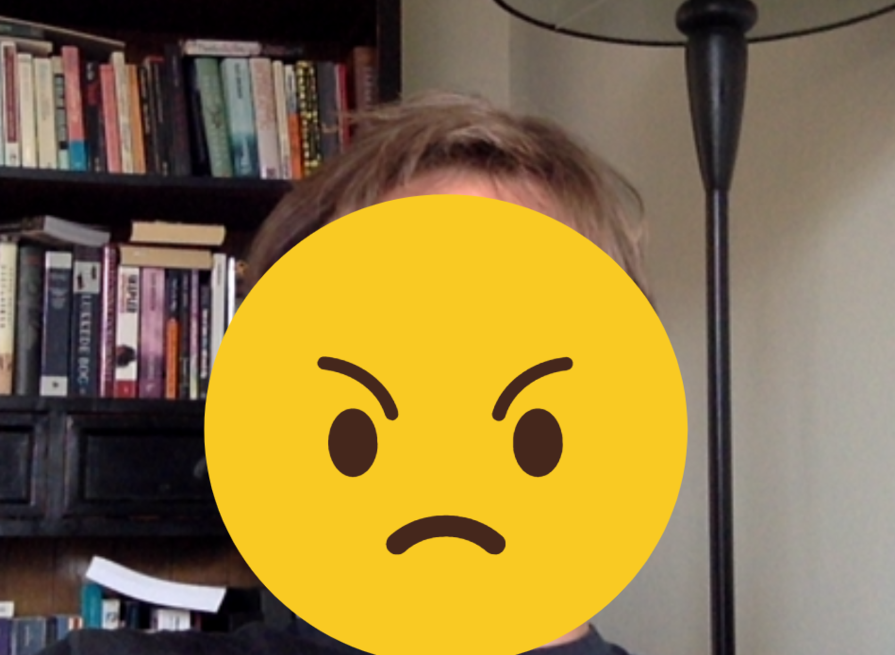
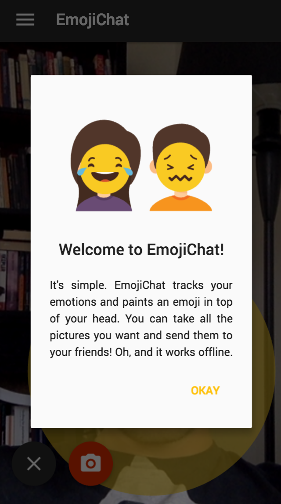

# EmojiChat

> Author: Frederik Wessberg (frra@itu.dk), June 2017

## Demo

EmojiChat is live at [https://itu.dk/people/frra/EmojiChat](https://itu.dk/people/frra/EmojiChat)

## Description

EmojiChat is a based on a simple concept: It tracks your and head position and facial expressions in real-time
and puts an Emoji on top of your head that represents your current mood.

## Technology

EmojiChat use a variety of modern web technologies:

- It is **Offline-First**. It uses a **Service-Worker** for precaching static assets and loads even when you are offline. It ships a custom-built offline-first, decentralized client-to-client database `SyncDB` for data persistence based on IndexedDB.
- It is **Mobile-First** and fully **responsive**. It is built from the ground-up to look and feel great on mobile devices and treats Mobile as separate compile-target.
- It follows the **Material Design** specification strictly. All elements, such as the `AppBarComponent`, `CardComponent`, `RippleComposite` and `FloatingButtonComponent` are custom and thorough implementations of the spec.
- It is **fully vanilla**, entirely built using **built-in browser and EcmaScript APIs and data structures** such as:
  - **Web Components**: It uses [**Custom Elements**](https://www.w3.org/TR/custom-elements/), encapsulates components using the [**Shadow DOM**](https://www.w3.org/TR/shadow-dom/) and stamps markup using [**HTML templates**](https://www.w3.org/TR/html-templates/).
  - **WebGL**: It uses **[WebGL](https://www.khronos.org/registry/webgl/specs/latest/2.0/)** for rendering the recognized facial model.
  - **Web Workers**: It computes emotions and facial expressions using **[Web Workers](https://www.w3.org/TR/workers/)** to keep the UI thread clean.
  - **Service Workers**: It precaches all static assets using a **[ServiceWorker](https://w3c.github.io/ServiceWorker/)** so the app can load and work even when you're offline.
  - **CSS Custom Properties**: It embraces CSS reusability and maintainability using **[CSS variables/CSS Custom Properties](https://www.w3.org/TR/css-variables-1/)**.
  - **Intersection- and Mutation Observers**: It tracks visible gallery items in just a few lines of code using the native **[IntersectionObserver](https://wicg.github.io/IntersectionObserver/)** and **[MutationObserver](https://developer.mozilla.org/en-US/docs/Web/API/MutationObserver)** APIs.
  - **Web Animations**: It uses the native **[Web Animations](https://www.w3.org/TR/web-animations-1/)** API for fluent, optimized animations.
  - **Pointer Events**: It uses the unified **[Pointer Events](https://www.w3.org/TR/pointerevents/)** spec for tracking pointer device events, rather than using traditional Mouse- and Touch-events.
  - **AOT Compilation**: It dedupes CSS selectors
  
Because of this, EmojiChat only works in **Chrome**, **Opera** and **Safari** for the time being. While Safari *is* supported, **Chrome and Opera will provide the best user experience for this showcase**.

## Installation instructions

1. Clone this repository using `git clone` from your terminal (or download it [here](https://github.com/wessberg/creative_implementation/archive/master.zip)).
2. `cd` into the directory.
3. Run `npm install`.

All dependencies will now be installed. You're now able to build the app!

## Build instructions

After installing the dependencies, there's a variety of build-scripts you can run:

- `npm run build` or `npm run b`: Generates a development bundle for both mobile and desktop devices.
- `npm run build:desktop` or `npm run b:desktop`: Generates a development bundle for only desktop devices.
- `npm run build:mobile` or `npm run b:mobile`: Generates a development bundle for only mobile devices.
- `npm run build:production` or `npm run b:production`: Generates a production bundle for both mobile and desktop devices. All files will be minified and gzipped, and all component styles will be deduped and minified using PostCSS and CSSNano. All `:hover` selectors will be stripped from the mobile bundle. 
- `npm run build:desktop:production` or `npm run b:desktop:production`: Generates a production bundle for only desktop devices. All files will be minified and gzipped, and all component styles will be deduped and minified using PostCSS and CSSNano.
- `npm run build:mobile:production` or `npm run b:mobile:production`: Generates a development bundle for only mobile devices. All files will be minified and gzipped, and all component styles will be deduped and minified using PostCSS and CSSNano. All `:hover` selectors will be stripped from the bundle.
- `npm run sw:precache`: Generates a *service-worker* file of all assets and associated hashes. Run this script whenever your assets change.

All of the `build` scripts also have equal `watch` or `w` variants for the same purpose, except they watch the source files and recompiles when something changes.
All of the `watch` scripts also have equal `serve` or `s` variants which serves a simple custom development server so you can easily work from localhost.

## How the shared gallery works

The shared gallery is pretty unique. Every picture taken by *any* EmojiChat user will end up in this gallery. Only the one who took the picture can remove it again. The data persistence model is fully decentralized. There is no remote database. Rather, you communicate with other clients currently connected to EmojiChat to replicate and distribute your local database contents so that the gallery contents are the same between all of you.